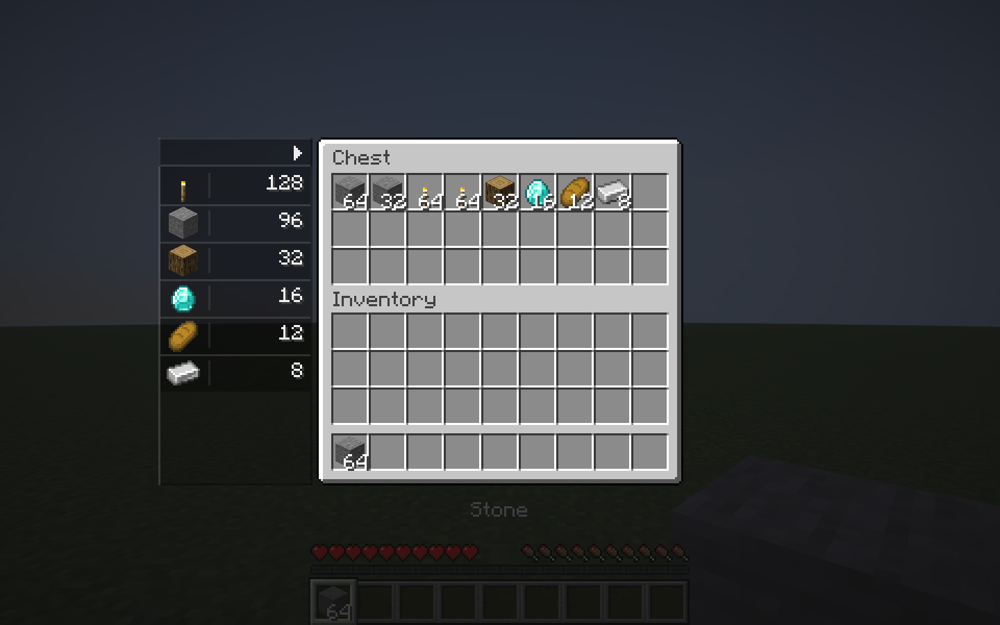

# Chest Count Overlay

[简体中文](README.md) | **English**

A **client-only Fabric mod for Minecraft Java 1.21.11 and Java 21**. It adds a compact item-count rail beside vanilla chest-like screens, including chests, double/trapped chests, barrels and shulker boxes.



- Combines matching items with identical data components. Sorts by descending total, preserving first-seen order for ties.
- Optionally counts synchronized contents of carried shulker boxes, bundles and similar item-stack containers, including the container item itself.
- Starts collapsed. Click the small top arrow or press the grave-accent key (`` ` `` / `~`) to expand. Hover over the rail and scroll for additional item types.
- Keeps expansion state for the current client session and resets it on restart. Never modifies inventories or adds a server protocol.
- Provides English/Chinese YACL settings through Mod Menu. Nothing needs installing on the server.

[Modrinth](https://modrinth.com/mod/chest-count-overlay) · [GitHub Releases](https://github.com/chenjicheng/chest-count-overlay/releases) · [User guide](docs/en/guide.md) · [Development and releases](docs/en/development.md)

## Install

Install `chest_count_overlay-1.0.1.jar`, [Fabric API](https://modrinth.com/mod/fabric-api) and [YACL](https://modrinth.com/mod/yacl) on your client with Fabric Loader **0.18.0 or newer**.

Validated with Fabric API `0.141.4+1.21.11` and YACL `3.8.1+1.21.11-fabric`. YACL is required; [Mod Menu](https://modrinth.com/mod/modmenu) is an optional settings entrypoint. Do not install the `-sources.jar`. Remove the previous mod JAR when upgrading.

Only the open container and already synchronized contents can be counted. Player inventory, unresolved loot tables and containers with unrelated custom screens are excluded. Nested traversal has depth and visit limits; read the [scope and limitations](docs/en/guide.md#scope-and-limitations).

## Build and screenshots

```powershell
.\gradlew.bat build
.\scripts\screenshots.ps1 -AcceptMinecraftEula
```

The screenshot script creates an isolated test world under `build`, opens real container and settings screens, checks counting/input behavior, and copies seven original PNGs into the documentation. Pass the switch only after accepting the [Minecraft EULA](https://aka.ms/MinecraftEULA). Images use automated test data and do not require a personal save.

Pushing a `v*` tag matching `mod_version` runs build, release validation and client tests before independent jobs publish the same installable JAR to GitHub and Modrinth. VitePress documentation from `main` deploys to GitHub Pages. See [release setup](docs/en/development.md#release-process).

Licensed under [MIT](LICENSE).
